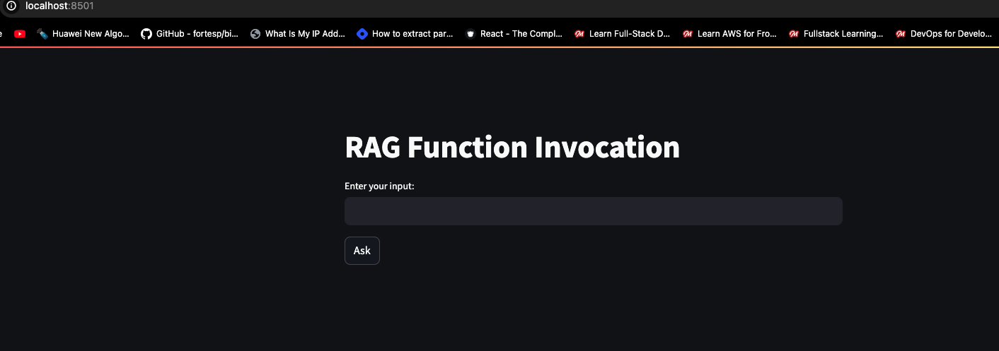

# 2. Open-Source LLMs
Here we look at how to use `open-source LLMs` instead of LLMs like `OpenAI`, `Groq` etc and also how to run them locally on CPU machine using `Ollama` and `elasticsearch` as the data store for the `RAG` workflow.

For more details and instructions follow the course material [**here**](https://github.com/DataTalksClub/llm-zoomcamp/tree/main/02-open-source)

## Open-Source LLMs - Introduction
See course video [**here**](https://github.com/DataTalksClub/llm-zoomcamp/tree/main/02-open-source#21-open-source-llms---introduction)

## Using a GPU in Saturn Cloud
To be able to work with open-source llms, we still need strong machines with better compute power and memory, so the need to use GPU resources. i.e `Google Colab`, `Saturn Cloud`, `Kaggle`, or Rent `AWS GPU instances`.

Follow the course material [**here**](https://github.com/DataTalksClub/llm-zoomcamp/tree/main/02-open-source#22-using-a-gpu-in-saturn-cloud) to be able to:

- Register for Saturn Cloud account if you don't have one.
- Configure secrets and git in saturn cloud
- Create an instance with a GPU

**Links**:

- https://saturncloud.io/
- https://github.com/DataTalksClub/llm-zoomcamp-saturncloud

### Google Colab as an alternative:

- [**Video**](https://www.loom.com/share/591f39e4e231486bbfc3fbd316ec03c5)
- [**Notebook**](https://colab.research.google.com/drive/1XmxUZutZXoAEdQZU45EXWPseBX9s2NRd)
- [**Notebook: 2**](https://colab.research.google.com/drive/1XmxUZutZXoAEdQZU45EXWPseBX9s2NRd#scrollTo=R8Ug4mk7UQVk)

## FLAN-T5 (google/flan-t5-xl)

- Model: `google/flan-t5-xl`
- Notebook: [huggingface-flan-t5.ipynb](./huggingface-flan-t5.ipynb)

Links:

- https://huggingface.co/google/flan-t5-xl
- https://huggingface.co/docs/transformers/en/model_doc/flan-t5

**Explanation of Parameters**:

- `max_length`: Set this to a higher value if you want longer responses. For example, max_length=300.
- `num_beams`: Increasing this can lead to more thorough exploration of possible sequences. Typical values are between 5 and 10.
- `do_sample`: Set this to True to use sampling methods. This can produce more diverse responses.
- `temperature`: Lowering this value makes the model more confident and deterministic, while higher values increase diversity. Typical values range from 0.7 to 1.5.
- `top_k` and `top_p`: These parameters control nucleus sampling. **top_k** limits the sampling pool to the top k tokens, while **top_p** uses cumulative probability to cut off the sampling pool. Adjust these based on the desired level of randomness.

## Phi 3 Mini (microsoft/Phi-3-mini-128k-instruct)

- Model: `microsoft/Phi-3-mini-128k-instruct`
- Notebook: [huggingface-phi3.ipynb](./huggingface-phi3.ipynb)

**Links**:

- https://huggingface.co/microsoft/Phi-3-mini-128k-instruct

## Mistral-7B and HuggingFace Hub Authentication

- Model: `mistralai/Mistral-7B-v0.1`
- Notebook: [huggingface-mistral-7b.ipynb](./huggingface-mistral-7b.ipynb)

[**ChatGPT instructions for serving**](./serving-hugging-face-models.md)

**Links**:

- https://huggingface.co/docs/transformers/en/llm_tutorial
- https://huggingface.co/settings/tokens
- https://huggingface.co/mistralai/Mistral-7B-v0.1

## Other models
- [**LLM360/Amber**](https://huggingface.co/LLM360/Amber)
- [**Gemma-7B**](https://huggingface.co/blog/gemma)
- [**SaulLM-7B**](https://huggingface.co/papers/2403.03883)
- [**Granite-7B**](https://huggingface.co/ibm-granite/granite-7b-base)
- [**MPT-7B**](https://huggingface.co/mosaicml/mpt-7b)
- [**OpenLLaMA-7B**](https://huggingface.co/openlm-research/open_llama_7b)

**Where to find them**:

- Leaderboards
- Google
- ChatGPT

**Links**:

- https://huggingface.co/spaces/open-llm-leaderboard/open_llm_leaderboard
- https://huggingface.co/spaces/optimum/llm-perf-leaderboard


## Ollama - Running LLMs on a CPU

- The easiest way to run an LLM without a GPU is using [**Ollama**](https://github.com/ollama/ollama)
- Notebook [ollama.ipynb](./ollama.ipynb)

**Sample guide for Linux**:

```sh
curl -fsSL https://ollama.com/install.sh | sh

ollama start
ollama pull phi3
ollama run phi3
```

[**Prompt example**](./prompt.md) to experiment with.

Connecting to it with OpenAI API with ollama running locally:

```python
from openai import OpenAI

client = OpenAI(
    base_url='http://localhost:11434/v1/',
    api_key='ollama',
)
```

### Running Ollama with Docker

```sh
docker run -it \
    -v ollama:/root/.ollama \
    -p 11434:11434 \
    --name ollama \
    ollama/ollama
```

#### Pulling the model
Enter the ollama shell and then pull the ollama model you want to use

```sh
docker exec -it ollama bash
ollama pull phi3
```

Now test with the notebook [**ollama.ipynb**](./ollama.ipynb)

## Ollama & Phi3 + Elastic in Docker-Compose
Putting everythin together using elasticsearch as the data store for the `rag` workflow.

- Creating a Docker-Compose file with `ollama` and `elasticsearch` services: [**docker-compose**](./docker-compose.yml)
- Re-running the module 1 notebook
- Notebook: [**rag-intro-elasticsearch.ipynb**](./rag-intro-elasticsearch.ipynb)

## UI for RAG (streamlit)
Sample UI application for `RAG` workflow using `streamlit` python library

Install the dependencies

```sh
pip install stream watchdog
```

- Putting it in Streamlit
- [**Code**](./qa_faq.py)

Run the application

```sh
streamlit run qa_faq.py
```



Learn more about [**streamlit**](https://docs.streamlit.io/), you can use [**this material**](https://github.com/DataTalksClub/project-of-the-week/blob/main/2022-08-14-frontend.md) from DataTalksClub repository with [**projects of the week**](https://github.com/DataTalksClub/project-of-the-week/tree/main).


## Notes: Curated sources
- https://machine-mind-ml.medium.com/open-sourced-vs-closed-sourced-llms-2392c7db6e10
- https://github.com/dimzachar/llm_zoomcamp/blob/master/notes/02-open-source/README.md
