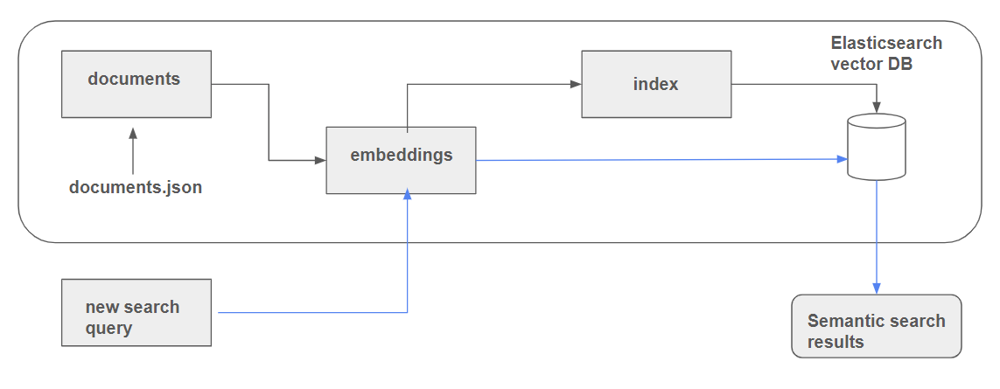

# Vector Search

See course module [**here**](https://github.com/DataTalksClub/llm-zoomcamp/blob/main/03-vector-search/README.md)

## Introduction to Vector Search
- [Slides](https://github.com/dataML007/elastic_search/blob/main/Introduction%20to%20Vector%20DB.pdf)

## Semantic Search with ElasticSearch
- [Notebook](./demo_es_semantic_search.ipynb)

## Evaluating Retrieval

- [Evaluation Metrics](./eval/evaluation-metrics.md)

### Getting ground truth data
- Approaches for getting evaluation data
- Using OpenAI/Alternatives to generate evaluation data

**Links**:

- [Notebook](./eval/ground-truth-daata.ipynb)
- [documents with ids](./eval/documents-with-ids.json)
- [queries generated by Groq (OpenAI Alternative) (pickle)](./eval/results.bin)
- [ground truth dataset - csv](./eval/ground-truth-data.csv)

### Ranking evaluation: text search
- Elasticsearch with text results
- minsearch

**Links**:

- [Notebook](./eval/evaluate-text.ipynb)

### Ranking evaluation: vector search
- Elasticsearch with vector search
- Ranking with question, answer, question+answer embeddings

**Links**:

- [Notebook](./eval/evaluate-vector.ipynb)

### Homework

**Links**:

- [Notebook](./homework.ipynb)
