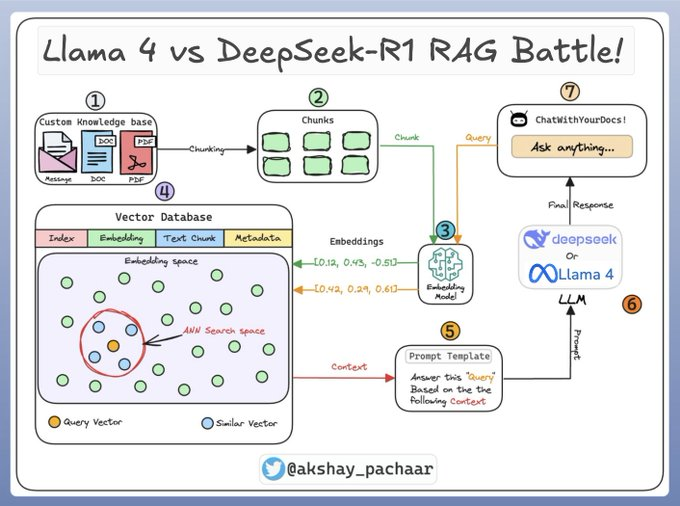
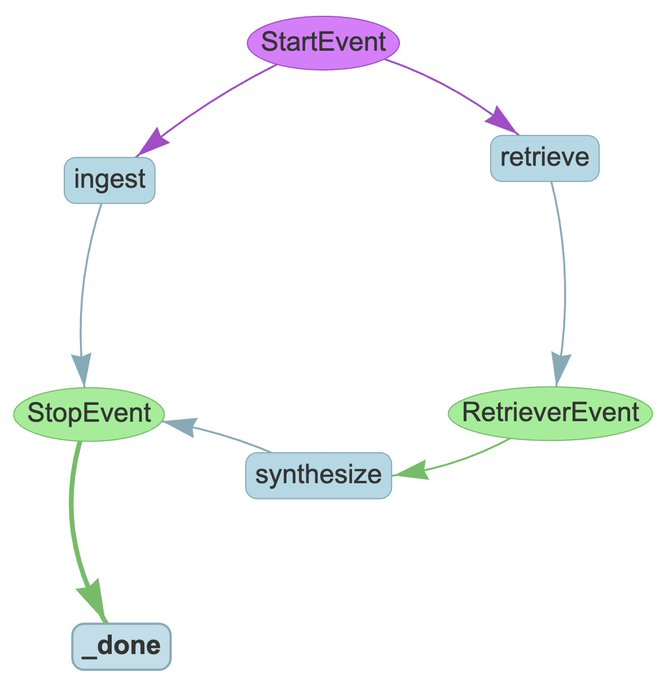

# Compare Metta Llama 4 and DeepSeek-R1 using RAG
Resource: https://x.com/akshay_pachaar/status/1908875045411377408

Github Resource: https://github.com/patchy631/ai-engineering-hub/tree/main/llama-4_vs_deepseek-r1

We're building a Streamlit app to compare MetaAI's Llama 4 against DeepSeek-R1 using RAG.

### [Nomic AI](https://www.nomic.ai/)
- [Embedding model](https://www.nomic.ai/embed)
- [Nomic AI embedding model](https://huggingface.co/nomic-ai/nomic-embed-text-v1)

### Opik - Monitoring and Evaluation
- [Opik Overview](https://www.comet.com/docs/opik/self-host/overview)

### Create the Workflow

To orchestrate this app, we'll use the LlamaIndex workflow, an event-driven, step-based method to control the execution flow of an app.

A start event triggers the workflow, and a stop event terminates it.

