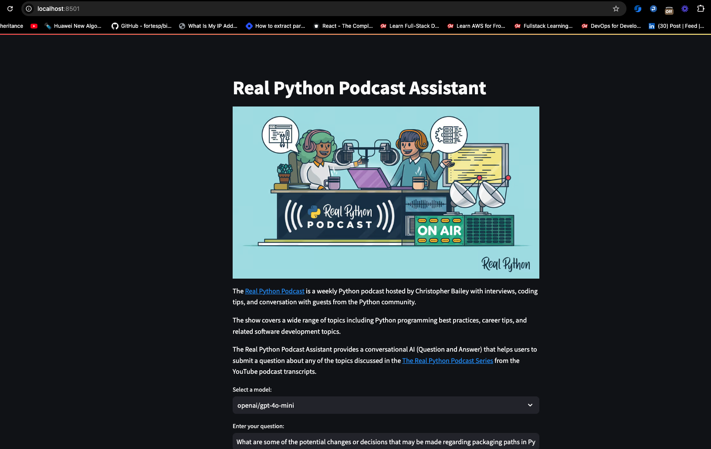
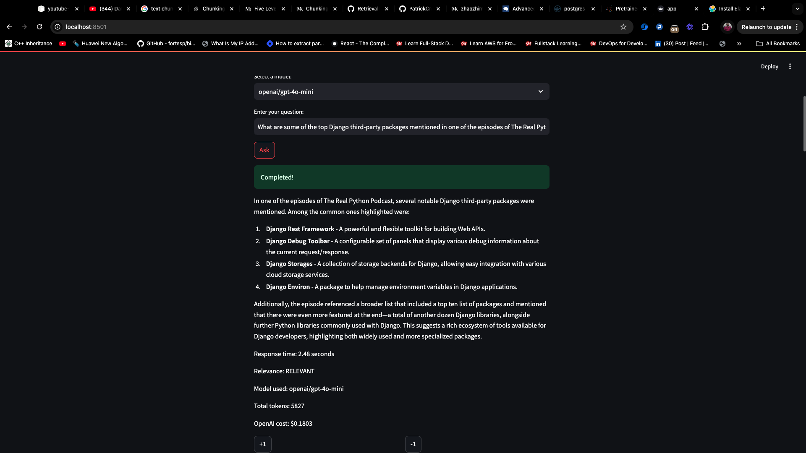
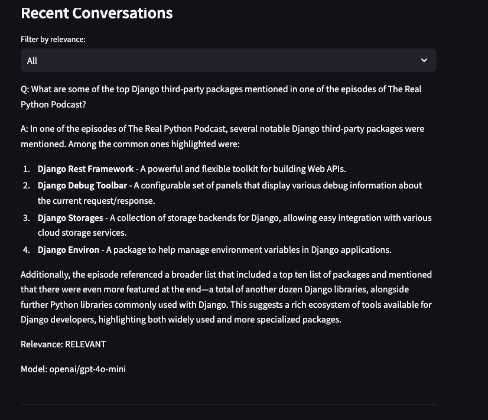
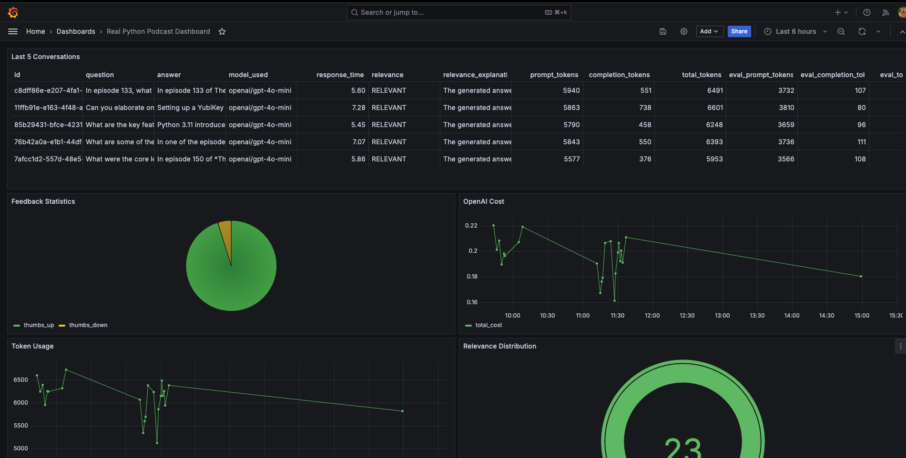

# Project: The Real Python Podcast Assistant


The [Real Python Podcast](https://realpython.com/podcasts/rpp/) is a weekly Python podcast hosted by Christopher Bailey with interviews, coding tips, and conversation with guests from the Python community.

The show covers a wide range of topics including Python programming best practices, career tips, and related software development topics.

The Real Python Podcast Assistant provides a conversational AI (Question and Answer) that helps users to submit a question about any of the topics dicussed in the [The Real Python Podcast Series](https://www.youtube.com/playlist?list=PLP8GkvaIxJP0zDf2TqlGkqlBOjIuzm_BJ) from the youtube podcast transcripts.


The [README.md] file provides two sections:
1. Instructions on how to generate a dataset of YouTube transcripts for "The Real Python Podcast" in a reproducible way. The code snippets below are just illustrating how the transcripts were generated from youtube playlist and saved in json files. 

To fully test the transcription generation see the [transcription.py](./transcription.py) module.
The saved json transcript dataset files can be found in the [data](./data/) folder

2. How to setup the assistant with docker and docker-compose and test with the streamlit UI interface in the browser.

## Technologies

- Python 3.9+
- Docker and Docker Compose for containerization
- [ElasticSearch](https://www.elastic.co/guide/en/elasticsearch/reference/current/docker.html) for full-text search and vectorstore
- Streamlit as the UI interface (see [Streamlit Documentation](https://docs.streamlit.io/) for more information on Streamlit)
- Grafana for monitoring and PostgreSQL as the backend for it
- OpenAI as an LLM or Ollama/Phi3 as opensource LLM locally.


## The Real Python Podcast YouTube Transcripts Dataset

This project aims to generate a dataset of YouTube transcripts for episodes of [**The Real Python Podcast**]((https://realpython.com/podcasts/rpp/)). The dataset is built by fetching video transcripts from a [YouTube playlist]((https://www.youtube.com/playlist?list=PLP8GkvaIxJP0zDf2TqlGkqlBOjIuzm_BJ)) and cleaning them for further analysis or use.

### Table of Contents
- [Prerequisites](#prerequisites)
- [Getting Started](#getting-started)
- [Instructions](#instructions)
- [How It Works](#how-it-works)
- [Sample Output](#sample-output)

### Prerequisites

Before you begin, ensure you have the following:

1. **Python 3.9+** installed.
2. **YouTube API key** to access the YouTube Data API.
3. **OpenAI API Key** Openai api key to use with openai llm models to help in clean and chunking transcripts.
3. **Google YouTube Transcript API**: Install the necessary library for fetching video transcripts.
4. Basic understanding of Python and using APIs.

### Install Required Python Packages

Install the necessary Python packages by running:

```bash
pip -r requirements.txt
```

### Getting Started

Follow the steps below to generate the dataset for YouTube transcripts.

#### 1. Clone the Repository

Clone the repository to your local machine:

```bash
git clone https://github.com/PatrickCmd/llm-zoomcamp.git
cd llm-zoomcamp/project
```

#### 2. Set Up Your YouTube API Key

You'll need a YouTube API key to access the YouTube Data API.

1. Go to the [Google Cloud Console](https://console.cloud.google.com/).
2. Create a new project.
3. Navigate to the **API & Services** dashboard and enable the **YouTube Data API v3**.
4. Create credentials for the API and get your API key.
5. Replace `YOUR_YOUTUBE_API_KEY` in the code with your actual API key.

#### 3. Fetching the Playlist Data

To get the list of video IDs from the playlist, you need to run the following script, which fetches the videos from the **The Real Python Podcast** YouTube playlist.

```python
import os
import json
from googleapiclient.discovery import build

# Replace with your actual YouTube API key
YOUTUBE_API_KEY = 'YOUR_YOUTUBE_API_KEY'

def get_playlist_video_ids(playlist_url):
    youtube = build('youtube', 'v3', developerKey=YOUTUBE_API_KEY)
    
    # Extract the playlist ID from the URL
    playlist_id = playlist_url.split('list=')[-1]
    
    video_ids = []
    next_page_token = None
    
    while True:
        playlist_items_request = youtube.playlistItems().list(
            part='contentDetails',
            playlistId=playlist_id,
            maxResults=50,
            pageToken=next_page_token
        )
        playlist_items_response = playlist_items_request.execute()
        
        for item in playlist_items_response['items']:
            video_ids.append(item['contentDetails']['videoId'])
        
        next_page_token = playlist_items_response.get('nextPageToken')
        if not next_page_token:
            break
    
    return video_ids
```

#### 4. Fetching YouTube Transcripts

You can now fetch the transcripts for each video in the playlist by running the following script.

```python
from youtube_transcript_api import YouTubeTranscriptApi

def fetch_transcripts(video_ids):
    transcripts = {}
    for video_id in video_ids:
        try:
            transcript = YouTubeTranscriptApi.get_transcript(video_id)
            transcripts[video_id] = transcript
        except Exception as e:
            print(f"Could not retrieve transcript for video ID: {video_id}, error: {str(e)}")
    
    return transcripts

# Example usage:
playlist_url = "https://www.youtube.com/playlist?list=PL1O_A4nqfoWx0uNdH9Z6tiFl2PRRkRR21"
video_ids = get_playlist_video_ids(playlist_url)
transcripts = fetch_transcripts(video_ids)

# Save transcripts to a JSON file
with open("real_python_podcast_transcripts.json", "w") as f:
    json.dump(transcripts, f, indent=4)
```

#### 5. Cleaning the Transcripts

You may want to clean the transcripts by removing timestamps or unnecessary text. Here's an example function to clean the text:

```python
def clean_transcript(self, transcript: str, cleaner):
        # Clean the transcript (e.g., remove timestamps, non-verbal sounds, etc.)
        chunks = self.semantic_chunking_spacy_multisentence(transcript_text=transcript)
        transcript = ""
        for chunk in chunks:
            cleaned_transcript, _, _ = cleaner.clean_transcript(chunk)

            # Refine the cleaned transcript for accuracy and formatting
            # refined_transcript, _, _ = cleaner.refine_transcript(cleaned_transcript)
            transcript += cleaned_transcript
        return transcript.strip()

# Example usage:
for video_id, transcript in transcripts.items():
    transcripts[video_id] = clean_transcript(transcript)

# Save cleaned transcripts
with open("cleaned_real_python_podcast_transcripts.json", "w") as f:
    json.dump(transcripts, f, indent=4)
```

#### 6. Saving the Dataset

Once the transcripts are cleaned, you can save them into a single JSON file or a CSV for easy access. You can use the following Python code to save the transcripts as a CSV file:

```python
import pandas as pd

def save_transcripts_to_csv(transcripts):
    data = []
    for video_id, transcript in transcripts.items():
        data.append({
            'video_id': video_id,
            'transcript': transcript
        })
    
    df = pd.DataFrame(data)
    df.to_csv('real_python_podcast_transcripts.csv', index=False)

# Save to CSV
save_transcripts_to_csv(transcripts)
```

#### How It Works

1. **Fetch Playlist Data**: Retrieves the list of video IDs from the YouTube playlist using the YouTube Data API.
2. **Fetch Transcripts**: Uses the `youtube-transcript-api` to fetch the transcript for each video in the playlist.
3. **Clean Transcripts**: Processes the raw transcripts, removing unnecessary text such as timestamps or non-verbal cues.
4. **Save Dataset**: The cleaned transcripts are saved in JSON or CSV format for further use.

#### Sample Output

After running the scripts, you'll have:

1. [real_python_podcast_transcripts.json](./data/real_python_podcast.json): A JSON file containing a sample raw and cleaned transcripts for each video.

#### **Explanation of the Sections:**

1. **Prerequisites**: Lists the required tools, including Python, the YouTube API, and necessary Python libraries.
2. **Getting Started**: Instructions to clone the repository, set up the API key, and install dependencies.
3. **Instructions**: Detailed steps for fetching video transcripts from YouTube, cleaning them, and saving them to a dataset.
4. **How It Works**: A quick explanation of the process.
5. **Sample Output**: Example outputs the user can expect after running the code.
6. **Contributing**: Encourages contributions to the project.
7. **License**: Mentions the licensing information. 

## Setting up and Running the Assistant with Streamlit

### Preparation

1. Clone the project repository and change to the project directory.

```sh
git clone https://github.com/PatrickCmd/llm-zoomcamp.git
cd llm-zoomcamp/project
```

2. Copy `.env_template` to `.env` and provide your `YOUTUBE_DATA_API_KEY` and `OPENAI_API_KEY`
```sh
cp .env_template .env
```

### Running the Application

Start the `streamlit`, `postgres`, `elasticsearch`, and `ollama` services by running the command

```sh
docker-compose up -d
```

#### Database and Elastic configuration
Before using the application for the first time, the database and elasticsearch need to be intialized. This also creates the vector embeddings for the youtube transcripts.

This uses the already fetched transcripts stored in the [data](./data) directory as `json` files.

```sh
docker-compose exec -it streamlit python prep.py
```

#### Ollama/Phi3 LLM configuration

To be able to use the open source `ollama/phi3` open source ollama llm locally we need to first pull the `phi3` model in the ollama container.

> **Note**: This work properly you need to have atleast configured `6GB` of memory for the docker container.

```sh
docker-compose exec -it ollama ollama pull phi3
```

#### Sentence Transformer Segmentation Fault
- https://github.com/UKPLab/sentence-transformers/issues/2332

```sh
export OMP_NUM_THREADS=1
```

#### Streamlit logs
To check if the streamlit application is running successfully, you can check the logs

```sh
docker-compose logs -f streamli
```

```
streamlit  |
streamlit  | Collecting usage statistics. To deactivate, set browser.gatherUsageStats to false.
streamlit  |
streamlit  |
streamlit  |   You can now view your Streamlit app in your browser.
streamlit  |
streamlit  |   Local URL: http://localhost:8501
streamlit  |   Network URL: http://172.20.0.6:8501
streamlit  |   External URL: http://196.250.65.157:8501
streamlit  |
```

Browse the streamlit apllication in the browser. http://localhost:8501



Select a model and submit a question about any topic discussed in any episode in the Real Python Podcast Series. Use sample questions in [data/real_python_podcast_questions.csv](./data/real_python_podcast_questions.csv)

After submit a question, a response will be returned, you can also give feed back by either `+1` or `-1`





To check the content of the database, use `pgcli`

```sh
docker-compose exec -it postgres apt-get update
docker-compose exec -it postgres apt-get install -y python3-pip
docker-compose exec -it postgres pip3 install pgcli --break-system-packages
docker-compose exec -it postgres pgcli -h localhost -U postgres -d realpython_podcast -W
```

You can view the schema using the `\d` command

```sh
\d conversations;
```

And select from this table

```sh
\x
```

```sql
SELECT * FROM conversations LIMIT 1;
```

```
Password for postgres:
Server: PostgreSQL 15.8 (Debian 15.8-1.pgdg120+1)
Version: 4.1.0
Home: http://pgcli.com
realpython_podcast> \d conversations
+------------------------+--------------------------+-----------+
| Column                 | Type                     | Modifiers |
|------------------------+--------------------------+-----------|
| id                     | text                     |  not null |
| question               | text                     |  not null |
| answer                 | text                     |  not null |
| model_used             | text                     |  not null |
| response_time          | double precision         |  not null |
| relevance              | text                     |  not null |
| relevance_explanation  | text                     |  not null |
| prompt_tokens          | integer                  |  not null |
| completion_tokens      | integer                  |  not null |
| total_tokens           | integer                  |  not null |
| eval_prompt_tokens     | integer                  |  not null |
| eval_completion_tokens | integer                  |  not null |
| eval_total_tokens      | integer                  |  not null |
| openai_cost            | double precision         |  not null |
| timestamp              | timestamp with time zone |  not null |
+------------------------+--------------------------+-----------+
Indexes:
    "conversations_pkey" PRIMARY KEY, btree (id)
Referenced by:
    TABLE "feedback" CONSTRAINT "feedback_conversation_id_fkey" FOREIGN KEY (conversation_id) REFERENCES conversations(id)

Time: 0.051s
realpython_podcast> \x
Expanded display is on.
Time: 0.000s
realpython_podcast> SELECT * FROM conversations LIMIT 1;
-[ RECORD 1 ]-------------------------
id                     | c8dff86e-e207-4fa1-ab60-d041537ee4f7
question               | In episode 133, what is the WebAuthn protocol and how is it changing the way Python developers manage user pa>
answer                 | In episode 133 of The Real Python Podcast, the discussion centers around the WebAuthn protocol and its implic>

### Key Points about WebAuthn and Its Impact on Password Management:

1. **Passwordless Authentication**: WebAuthn enables developers to authenticate users without relying on passwords. This approach addr>

2. **How WebAuthn Works**: The protocol involves a pipeline that connects the end user, an authentication device (like a fingerprint r>

3. **Biometric and Hardware Authentication**: WebAuthn leverages strong authentication methods, including biometric features built int>

4. **Library Support for Python Developers**: The podcast discusses several Python libraries that facilitate the integration of WebAut>

5. **Credential Management**: With WebAuthn, managing user credentials shifts focus from traditional password storage to handling publ>

6. **Industry Adoption**: The podcast emphasizes the growing trend towards adopting standards-based, passwordless solutions, with many>

In summary, the WebAuthn protocol represents a significant shift for Python developers and the broader tech landscape, aiming to simpl>
model_used             | openai/gpt-4o-mini
response_time          | 5.60076904296875
relevance              | RELEVANT
relevance_explanation  | The generated answer provides a comprehensive overview of the WebAuthn protocol and its implications for Pyth>
prompt_tokens          | 5940
completion_tokens      | 551
total_tokens           | 6491
eval_prompt_tokens     | 3732
eval_completion_tokens | 107
eval_total_tokens      | 3839
openai_cost            | 0.21126
timestamp              | 2024-09-10 00:19:29.235673+00
SELECT 1
```

## Monitoring

We use Grafana for monitoring the application. 

It's accessible at [localhost:3000](http://localhost:3000):

- Login: "admin"
- Password: "admin"

### Dashboards

<p align="center">
  
</p>

The monitoring dashboard contains several panels:

1. **Last 5 Conversations (Table):** Displays a table showing the five most recent conversations, including details such as the question, answer, relevance, and timestamp. This panel helps monitor recent interactions with users.
2. **+1/-1 (Pie Chart):** A pie chart that visualizes the feedback from users, showing the count of positive (thumbs up) and negative (thumbs down) feedback received. This panel helps track user satisfaction.
3. **Relevancy Distribution (Gauge):** A gauge chart representing the relevance of the responses provided during conversations. The chart categorizes relevance and indicates thresholds using different colors to highlight varying levels of response quality.
4. **OpenAI Cost (Time Series):** A time series line chart depicting the cost associated with OpenAI usage over time. This panel helps monitor and analyze the expenditure linked to the AI model's usage.
5. **Tokens Usage (Time Series):** Another time series chart that tracks the number of tokens used in conversations over time. This helps to understand the usage patterns and the volume of data processed.

- [`dashboard.json`](grafana/dashboard.json) - the actual exported grafana dashboard.

## Acknowledgements 

I thank the course participants for all your energy
and positive feedback as well as the course sponsors for
making it possible to run this course for free. 

## License

This project is licensed under the MIT License - see the [LICENSE](LICENSE) file for details.